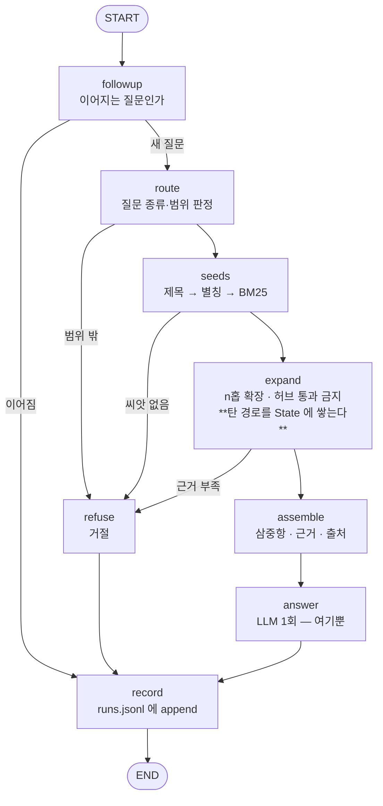
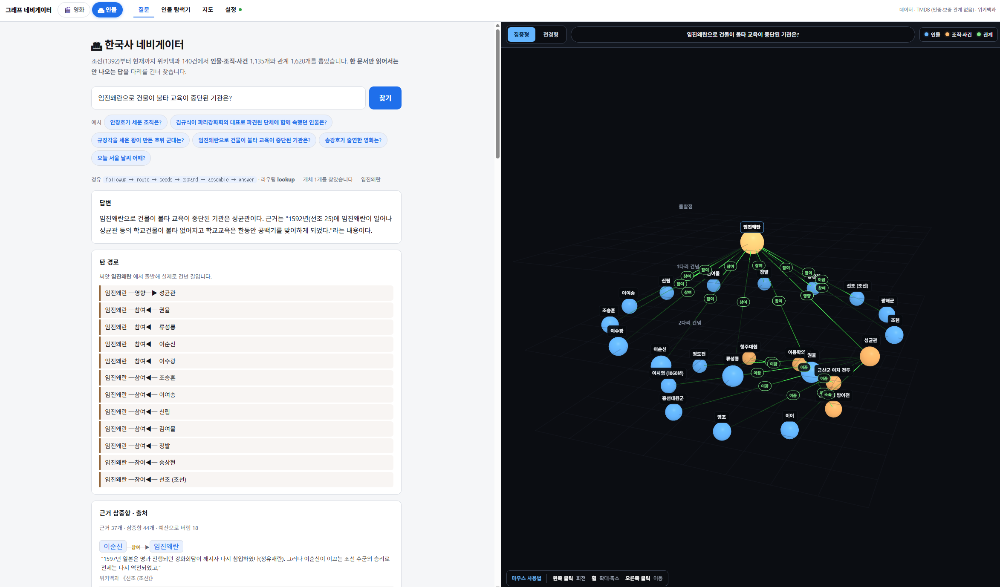
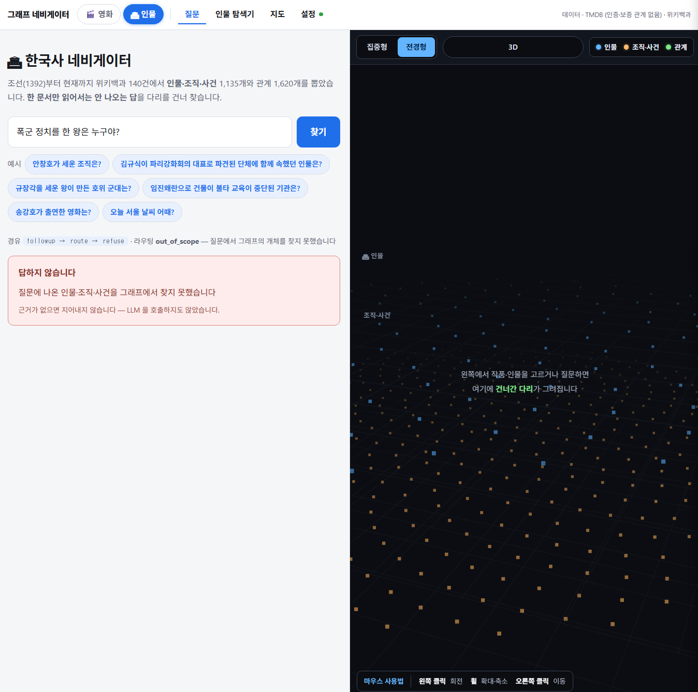
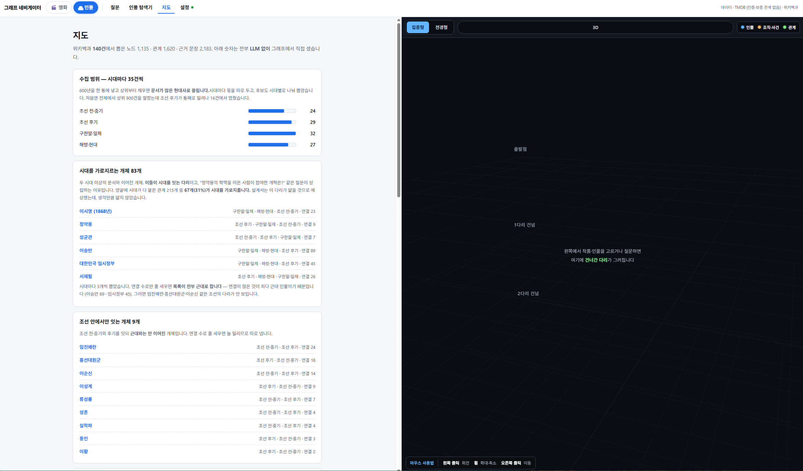
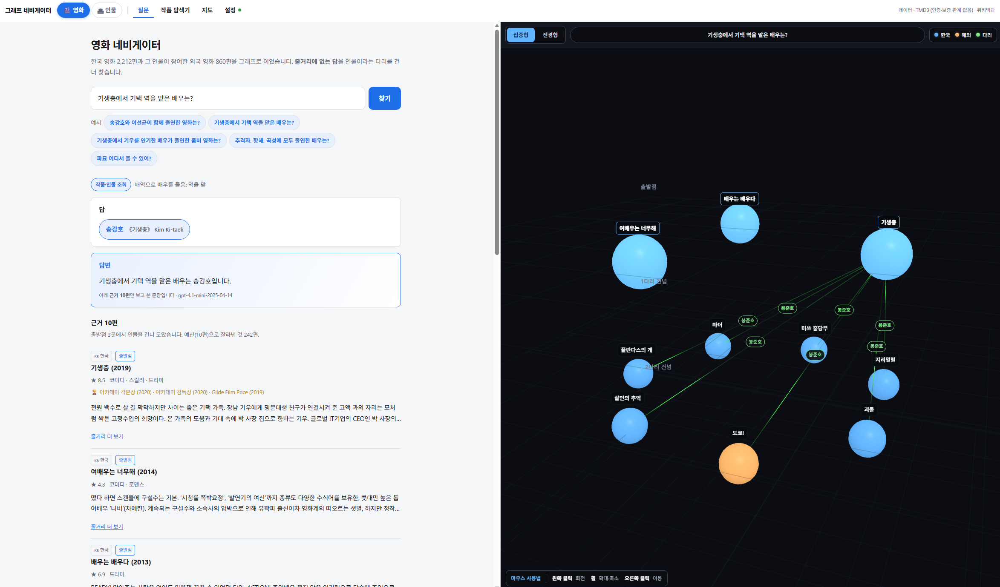
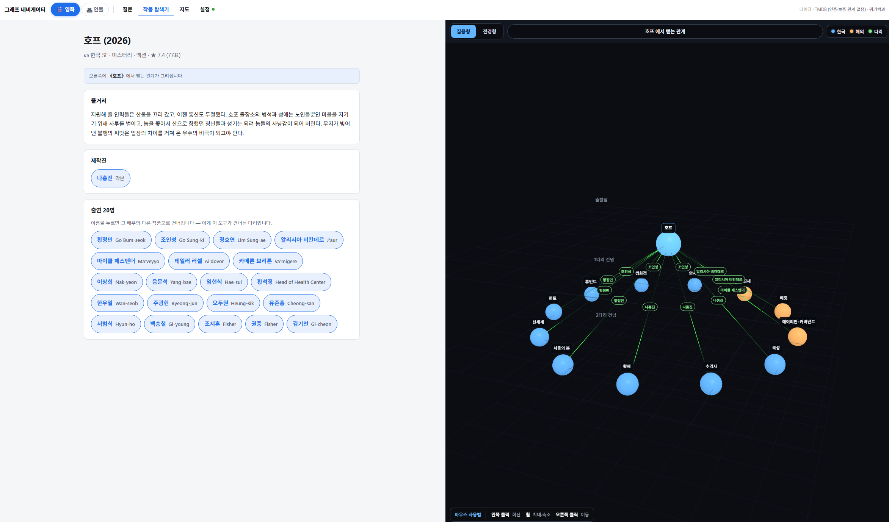

# REPORT — 그래프 네비게이터

> 모두의연구소 AGENT01 · 「7. 영화 추천 에이전트 만들기」 프로젝트
> 배포 <https://graph-navigator-kr.vercel.app> · 저장소 <https://github.com/GojoSuperman/graph-navigator>

**하나의 GraphRAG 엔진에 🎬 영화와 🏛 인물(한국사) 두 도메인이 붙어 있습니다.**
항목마다 두 도메인을 나란히 놓습니다 — 같은 설계를 **성질이 정반대인 두 코퍼스**에
적용한 결과라, 그 대조 자체가 이 보고서에서 가장 값어치 있는 부분입니다.

---

## 1. 주제와 코퍼스

### 왜 이 둘인가

| | 🎬 영화 | 🏛 인물 (한국사, 조선 1392 ~ 현재) |
|---|---|---|
| 고른 이유 | 한 문서만 읽어서는 답이 안 나오는 질문이 많다 — **배우 이름은 어느 줄거리에도 없다** | 한 인물이 여러 조직·사건에 걸친다. 둘을 잇는 것은 **사건이나 제3의 인물**이다 |
| 검증 가능성 | TMDB 크레딧이 정답 | 위키백과 원문에 관계 서술이 **문장으로** 있다 |
| 출처 | TMDB API | 한국어 위키백과 **MediaWiki API** (HTML 크롤링 안 함) |
| 규모 | 작품 3,072 (한국 2,212 · 외국 860) · 인물 27,282 · 관계 63,530 | 문서 140 · 노드 1,135 · 관계 1,620 · **근거 문장 2,183** |

**두 도메인을 함께 둔 이유가 이 프로젝트의 뼈대입니다.** 영화는 출연·연출 관계가
TMDB 크레딧에 **이미 구조화돼** 있어 규칙으로 뽑았습니다. 위키백과는 **산문**입니다.
그래서 인물 쪽에서는 LLM 으로 관계를 추출해야 하고, 과제가 요구하는
`① 추출 → ② 정제·병합` 단계가 **비로소 진짜로 드러납니다.**

### 채택·탈락 기준 (인물)

시드 43건(시대별) → 본문 링크로 2홉 확장 → 아래 기준으로 걸러 **140건**.

| 단계 | 기준 | 왜 |
|---|---|---|
| 후보 순위 | **여러 시드가 함께 가리킨 문서** 우선 | 둘을 잇는다는 것이 곧 다리다 |
| 시대 배분 | 시대마다 **300건씩 따로** 후보를 자르고 35건씩 채움 | 전체 상위를 자르면 현대사가 독식한다 |
| 분류 필터 | 시드와 **주제 분류 1개 이상 공유** | 링크가 있다고 같은 주제가 아니다 |
| 제외 | 연도 · **월-일** · 목록 · 틀 · 분류 문서 | `1919년`·`4월 19일` 은 링크가 수천 개라 **모두를 잇는 허브**가 된다 |
| 토막글 | 본문 800자 미만 탈락 | 관계 서술이 없어 엣지를 못 만든다 |

**결과: 후보 1,200건 대조 → 통과 675건(56%) → 시대마다 35건씩 총 140건.**
탈락 2건(관습도감 326자 · 전주 이씨 787자), API 백오프로 물러선 횟수 22.

#### 이 기준이 한 번 완전히 무력했습니다

처음 돌렸을 때 **분류 대조 통과율이 100%** 였습니다. 원인은 위키백과의 **유지보수 분류**입니다.

```
위키데이터 속성 P1273을 사용하는 문서   45/45 건 전부
해결되지 않은 속성이 있는 문서          45/45 건 전부
→ 분류 등장 1,673회 중 43% 가 이런 것
```

"시드와 분류를 1개 이상 공유" 라는 기준이 **위키백과의 아무 문서나 통과시키고**
있었습니다. 걷어내고 다시 재니 의도대로 갈렸습니다.

```
안창호 ↔ 김구    7개 공유   (같은 시대)   ✅
안창호 ↔ 세종    0개        (600년 차이)  ✅
세종   ↔ 정약용  4개        (둘 다 조선)  ✅
```

### 600년으로 넓힌 대가 — 예상이 틀렸습니다

설계 단계에서 **"넓히면 다리가 얇아진다"** 를 가장 큰 위험으로 잡았습니다.
LLM 추출 전에 **언급 그래프**(A 본문에 B 제목이 나오면 연결)로 먼저 쟀습니다 —
언급이 없으면 LLM 도 못 뽑으므로 **이것이 엣지 수의 상한**입니다.

| 예상 | 실측 |
|---|---|
| 넓히면 다리가 얇아진다 | **아니었다** — 평균 차수 27.6 · 고립 0건 · 연결 요소 1개 |
| 시대를 가로지르는 다리는 얇다 | **아니었다** — 양끝에 시대가 붙은 관계 215개 중 **67개(31%)** 가 교차 |
| 조선이 현대사보다 얇을 것 | 얇긴 하나 **현대사의 70% 수준** |

**기준을 결과 보기 전에 박아 두고 쟀습니다** (평균 차수 5 · 연결 요소 80% ·
다리 후보 50). 보고 나서 정하면 무슨 숫자가 나와도 통과시키게 됩니다.

---

## 2. 골든셋과 스키마

### 스키마 (인물) — 노드 3종 · 관계 6종

| 관계 | from → to | 판정 문장 |
|---|---|---|
| `PARTICIPATED_IN` | Person → Event | 그 사건에 참여·참전·가담했다 |
| `FOUNDED` | Person → Organization | 그가 그 조직을 설립·창설했다 |
| `MEMBER_OF` | Person → Organization | 그가 그 조직에 소속·가입·재직했다 |
| `LED` | Person → Org\|Event | **장(長)·대표·지휘자였다는 서술만** |
| `AFFECTED` | Event → Organization | **그 사건으로 조직이 해산·탄압·수립·분열됐다고 명시한 경우만** |
| `STUDIED_UNDER` | Person → Person | **from 이 제자, to 가 스승** |

노드는 `Person · Organization · Event` 셋뿐입니다.

### 관계 이름이 방향을 안 말하면 모델도 방향을 모릅니다

처음엔 `MENTORED | Person → Person | "정약용은 성호 이익의 학문을 이었다"` 라고
적었습니다. **이름은 스승→제자인데 예시는 제자→스승입니다.** 서로 반대입니다.

```
1차 추출 518건
  방향 판별 가능한 18건 중 14건(77%) 이 역방향
  39% 는 근거 문장에 사제 관계 어휘조차 없음
```

`STUDIED_UNDER`(제자가 스승 **밑에서 배웠다**)로 바꾸니 이름이 방향을 말합니다.
**184건으로 줄었고 방향이 잡혔습니다.**

> **교훈**: 이름으로 못 박을 수 있는 것을 주석으로 설명하려 들면 문서 140건에 걸쳐
> 추출이 제각각이 됩니다.

### 지어내기를 막는 방어막 — 하나로는 부족했습니다

**① `quote` 원문 대조** — 모델이 근거 문장을 함께 내게 하고, 그 문장이 원문에 **글자
그대로** 있는지 코드가 대조합니다. 없으면 버립니다.

그런데 《안창호》 한 건으로 먼저 돌려 **눈으로 읽어 보니** 통과율 83% 뒤에 이런 것들이
섞여 있었습니다.

```
✗ (안창호) ─MENTORED─▶ (이광수)
    "장택상은 그를 대통령이 될 자질을 갖춘 인물이라고 평가했다…"
    → 문장은 원문에 실재한다. 그런데 그 관계를 말하지 않는다

✗ (안창호) ─MENTORED─▶ (대한민국 임시정부)
    → MENTORED 는 Person → Person 인데 to 가 조직이다
```

**`quote` 대조는 "그 문장이 실재하는가" 만 보고 "그 문장이 그 관계를 말하는가" 는
못 봅니다.** 둘을 더 댔습니다.

**② 타입 서명 대조** (코드) — 관계마다 양끝 노드 타입을 고정하고 모델이
`fromType`·`toType` 을 같이 내게 했습니다. **전량에서 506건을 걸렀습니다.**

**③ 프롬프트 조항** — *"quote 는 그 관계를 **직접 서술**하는 문장이어야 한다.
두 개체가 같은 문장에 나온다고 관계가 있는 것이 아니다. 없으면 엣지를 내지 마라."*

**버린 방어막도 적습니다.** "quote 안에 from·to 이름이 둘 다 나올 것" 을 재 봤더니
48개 중 **10개(20%)만 살아남았습니다.** 표기 변형 때문입니다 — 《대한민국 임시정부》를
본문은 "임시정부" 라 쓰고 주어는 "그가" 로 받습니다. 정당한 엣지를 대량으로 버리는
필터라 **추출에는 쓰지 않았습니다.** 대신 **골든셋 선별과 근거 카드 표시에는 썼습니다** —
보여 줄 것을 고르는 데는 가혹한 쪽이 맞습니다.

### 뽑지 않기로 한 관계와 그 대가

| 안 뽑은 것 | 왜 | **대가** |
|---|---|---|
| **Place(지역)** | 한양·만주·상하이는 거의 모든 인물에 붙어 차수가 폭발한다. 그 지역을 지나는 경로는 "같은 곳에 있었다" 이상을 말하지 못한다 | "상하이에서 활동한 인물은?" 에 답할 수 없다 |
| **관직(官職)** | 《전라도관찰사》《삼도수군통제사》는 **자리**이지 조직이 아니다 | **조선 인물의 주 관계가 통째로 빠졌다** — 아래 참조 |
| **`RELATED_TO`(무방향)** | 방향이 의미를 가져야 하는데 이 하나만 무방향이었다. `AFFECTED`(Event→Org)로 방향을 박았다 | 조직이 사건을 일으킨 반대 방향을 못 담는다 |
| 혼맥 · 사화 · 붕당 | 스키마에 없다 | 조선 인물 간 관계가 얇아진다 |

#### 스키마가 근대 정치사에 치우쳤습니다 (가장 큰 설계 한계)

문서는 시대마다 35건으로 같은데 **관계는 4배 넘게 벌어집니다.**

```
구한말·일제  670   소속 218 · 이끔 192 · 설립 120     ← 조직 중심
해방·현대    435   이끔 156 · 소속 143 · 참여 71
조선 후기    206   참여 56 · 사사 48 · 이끔 38
조선 전·중기 154   참여 50 · 사사 47 · 이끔 29
```

위키백과 서술 밀도 차이도 있지만 **더 큰 원인은 스키마입니다.** 관계 6종 중
`FOUNDED · MEMBER_OF · LED` **셋이 조직을 전제**합니다. 근대에는 신민회·임시정부·
정당이 있지만 **조선에는 근대적 조직이 드뭅니다.** 조선 인물의 주된 관계는 관직·혼맥·
사화·붕당인데, 관직은 정제에서 **일부러 뺐고** 나머지는 애초에 스키마에 없습니다.

**스키마를 근대 정치사에 맞춰 짜놓고 600년에 적용한 셈입니다.**
`HELD_OFFICE` 같은 관계를 넣으면 조선이 두꺼워지겠지만, 평가와 동결이 끝난 뒤에
스키마를 흔드는 것은 **채점표를 고치는 일**에 가까워 하지 않았습니다.

### 정제·병합 (인물)

| 문제 | 조치 | 실측 |
|---|---|---|
| 호·시호가 다른 노드가 된다 | 위키백과 `redirects` + **본문 첫 문단의 호(號)** | 리다이렉트 12건 · **호 69건** |
| 표기 흔들림 | 중점·마침표·공백을 턴 키로 대조 | 26건 |
| 관직이 조직이 된다 | 접미사 사전으로 제외 | 32건 |
| 한국사 밖이 섞인다 | **목록**으로 제외 | 21건 |
| 직함이 이름에 붙는다 | `김대중 대통령` → `김대중` | — |
| 같은 관계 중복 | `from·to·kind` 중복 제거, **근거는 여러 개 보관** | 2,197 → 1,620 |

```
노드 1,221 → 1,135   (86개 별칭으로 병합)
타입 갈림 4개 (다수결) · 동명이인 의심 0개 · 정규화 키 중복 0
```

> **정규식으로 "외국" 을 잡으려다 `김일성`(62엣지)·`김정일` 을 버릴 뻔했습니다.
> 북한사는 한국사입니다.** 그래서 목록으로 두었습니다.

> **호(號)가 리다이렉트보다 훨씬 많이 합쳤습니다.** 백범→김구 · 우남→이승만 ·
> 몽양→여운형 · 도산→안창호 · 완당→김정희. 본문에서 뽑기로 한 것이 주효했습니다.

### 골든셋

| | 🎬 영화 | 🏛 인물 |
|---|---|---|
| 문항 | **152** | **52** |
| 묶음 | user-v0/v1/v2 · author-oos · author-cast · **holdout-100** | tuned 20 · **holdout 14** · bridge-hard 10 · 거절 8 |
| 홉 구성 | 배역·수상·교집합·거절 등 13종 | 1홉 10 · 2홉 27 · 3홉 7 · 거절 8 |
| 시대/시대교차 | — | 시대별 5~15 · 시대 교차 4 |

문항마다 **기대 정답 · 기대 경로(관계·순서·방향) · 원문 근거 · 기대 문서**를 적었습니다.
거절 문항은 `type: refusal` 로 구분해 경로·근거 필드를 비웁니다.

**문항을 그래프에서 기계적으로 뽑지 않았습니다.** 후보 경로마다 **근거 문장을 읽고**
그 문장이 답을 뒷받침할 때만 넣었습니다. 그래프로 그래프를 채점하면 순환이 됩니다.
실제로 이런 것들을 걸러냈습니다.

```
✗ (김종직) -MEMBER_OF-> (집현전)      집현전은 1456년 폐지, 근거에 김종직 없음
✗ (윤보선) -MEMBER_OF-> (한국민주당)   근거는 '민주당' 얘기
✗ (김종직) -STUDIED_UNDER-> (성종)     사제 관계 아님
```

`STUDIED_UNDER` 는 표본 정확도가 33% 라 **문항에서 전부 뺐습니다** — 정확도가 낮은
관계에 골든셋을 의존시키면 시스템이 아니라 그 관계를 재게 됩니다.

---

## 3. 측정 결과

### 재는 층 셋

| 층 | 무엇 | LLM |
|---|---|---|
| **컨텍스트 재현율** | 기대 문서가 근거에 들어왔는가 | **0회** |
| **경로 재현율** | 기대 경로의 홉이 실제 탄 경로에 있는가 | **0회** |
| **답변 정확도** | 근거가 맞을 때 답도 맞는가 | 문항당 1회 (캐시) |

**대조군에 같은 예산을 줍니다** — 그래프가 데려온 출처 문서 수만큼 BM25 에도 `k` 를
줍니다. 안 그러면 이긴 쪽이 예산 덕인지 구조 덕인지 갈리지 않습니다.

> 과제는 "basic RAG 대조" 라고 썼는데 **BM25** 를 씁니다. 대조군의 목적은 "그래프
> 없이 키워드만으로 어디까지 되는가" 이고, BM25 는 **LLM·임베딩 호출이 0회**라
> 하루에 몇 번이고 공짜로 다시 잽니다. 임베딩 대조군은 비용이 들어 그 자리를 못 지킵니다.

### 🏛 인물 — 홉 수별 (평균이 아니라 갈라서)

```
              그래프          BM25
  1홉        10/10 (100%)   10/10 (100%)
  2홉        25/27 ( 93%)   23/27 ( 85%)
  3홉         4/7  ( 57%)    5/7  ( 71%)
  ──
  전체       39/44 ( 89%)   38/44 ( 86%)
  거절        8/8  (100%)      —
```

### 이 프로젝트에서 가장 중요한 결과 — **BM25 가 이겼습니다**

설계 단계에서 *"2·3홉에서 BM25 가 무너지는 것이 이 프로젝트의 증명"* 이라고 적었습니다.
**정반대가 나왔습니다.**

```
묶음           그래프    BM25
  tuned         95%      90%
  holdout       79%      93%    ← BM25 가 14%p 앞선다
```

**원인은 시스템이 아니라 제 골든셋이었습니다.** 기대 문서의 **69%가 질문에 이름이 나온
문서**였습니다. 경로가 그래프상 3홉이어도 답의 근거가 질문 개체의 문서 안에 있으면
**그것은 멀티홉 문제가 아닙니다.**

| | 답이 있는 문서에 질문의 단어가 |
|---|---|
| 🎬 영화 | **없다** — 《기생충》 줄거리에 '송강호' 가 한 글자도 없다 → BM25 **원리적으로 불가** |
| 🏛 인물 | **있다** — 《안창호》 문서가 그가 세운 조직을 자기 안에 다 적는다 |

**위키백과 인물 문서는 그 인물의 관계를 자기 안에 다 적습니다.**

#### 채점표를 고치지 않고 묶음을 추가했습니다

기존 결과를 지우는 것은 채점표를 고치는 일입니다. 대신 **BM25 가 원리적으로 못 푸는**
조건 — *답의 근거 문서에 질문 개체의 이름이 한 번도 안 나온다* — 으로 그래프를 훑어
41개 경로를 찾고, 그중 10문항을 `bridge-hard` 로 **추가**했습니다.

```
  bridge-hard   그래프 90%   BM25 70%    ← 그래프가 20%p 앞선다
```

**같은 시스템인데 문항 성격에 따라 우열이 뒤집힙니다.** 그래서 이 프로젝트의 결론은
"GraphRAG 가 BM25 보다 낫다" 가 아니라 이것입니다 —

> **다리를 건너야만 닿는 질문에서만 낫고, 그런 질문은 위키백과 인물 도메인에서
> 생각보다 드물다. 도메인이 도구를 고르지, 도구가 도메인을 이기지 않는다.**

### 시대별 (인물)

```
  조선 전·중기   5/5  (100%)      구한말·일제  10/12 ( 83%)
  조선 후기     8/8  (100%)      해방·현대    13/15 ( 87%)
  시대 교차     3/4  ( 75%)
```

### 경로 재현율

```
  1홉 100%  ·  2홉 63%  ·  3홉 28%  ·  전체 66%
```

기대 홉의 34% 가 실제 탄 경로에 없습니다. **예산을 늘려도 안 오르므로 탐색 문제가
아닙니다** — 기대 경로의 표기가 그래프와 다르거나, 탐색이 다른 길로 도달한 것입니다.

### 답변 정확도 — 이 층을 안 쟀으면 28%p 를 못 봤습니다

```
          컨텍스트 재현율   답변 정확도
  1홉          100%           80%
  2홉           93%           67%
  3홉           57%           14%
  ──
  전체          89%           61%     ← 28%p 격차
  거절         100%          100%
```

**근거는 89% 데려오는데 답변은 61% 입니다.** 재현율만 적었으면 그만큼 부풀려
말했을 것입니다.

### 실패의 층 (색인 · 탐색 · 생성)

노드에 이름이 있으니 **어디서 끊겼는지가 `trace` 에 그대로 남습니다.** 따로 추론할
필요가 없었습니다.

```
질문   오늘 서울 날씨 어때?
경유   followup → route → refuse          ← 이 한 줄이 층 분류다
```

```
둘 다 성공                        22/44
생성 (근거는 왔는데 답이 틀림)      17/44   ← 손실의 77%
탐색 (근거를 못 데려옴)              5/44
색인 (기대 문서가 코퍼스에 없음)      0/44   ← 수집이 제 몫을 했다
```

#### 원인을 세 번 짚어 두 번 틀렸습니다

| 가설 | 검증 | 결과 |
|---|---|---|
| ① 근거가 157개라 묻혔다 | `maxNodes` 10/20/40/80 스윕 | ❌ **답변 정확도가 평평했다** (43~50%) |
| ② 탄 경로를 프롬프트에 안 줬다 | 경로를 근거 블록에 추가 후 재측정 | ❌ 50% 그대로 |
| ③ **근거가 30개에서 잘렸다** | 답이 든 삼중항의 위치를 추적 | ✅ **90번째** |

```
h2-07  "1948년 김규식이 참여한 협상에 함께 참여한 인물은?"
       (김구) ─참여─▶ (남북협상)   ← 138개 중 90번째
       evidenceBlock(limit = 30)    ← 앞 30개만 전달
       모델: "근거에서 확인되지 않습니다"
```

**모델은 답을 본 적이 없었습니다.** 고친 뒤 전체 50→61%, 2홉 48→67%,
"확인되지 않습니다" 12건→6건.

> **①이 평평했던 이유도 이것이었습니다.** `maxNodes` 를 40이든 80이든 올려도
> **30에서 잘려** 모델에게 가지 않았습니다. **한 지표가 둔감할 때 "영향 없음" 으로
> 읽으면 안 됩니다 — 그 사이에 막힌 데가 있는지 먼저 봐야 합니다.**
>
> ②는 효과가 0이었지만 되돌리지 않았습니다. **효과가 없는 것과 틀린 것은 다릅니다.**

### 실패 사례 정독

코드 판정표는 분포를 보여 주지만 **원인은 보여 주지 않습니다.** 대표 5건을 손으로
읽었습니다 → **[docs/실패 정독.md](docs/실패%20정독.md)**

그중 하나는 **골든셋이 틀린 경우**였습니다.

```
질문   동학 농민 운동을 지휘한 인물이 나중에 이끈 정부 기구는?
기대   대한민국 임시정부 (김구를 상정)
실제   "전봉준이 나중에 이끈 정부 기구는 집강소입니다"
```

**모델이 맞고 제가 틀렸습니다.** "동학 농민 운동을 지휘한 인물" 은 전봉준이 더
자연스럽고 근거가 그것을 뒷받침합니다. 고치면 점수가 오르지만 **시스템이 나아진 것이
아니므로 고치지 않고 기록만 남겼습니다.**

또 하나는 **모델의 거절 판단을 믿을 수 없다**는 증거입니다. 거절 문항 8/8 을 막은 것은
`route` 노드가 **LLM 전에 코드로** 걸렀기 때문이고, 모델 자신은 한쪽에서 있는 것을
없다 하고(6건) 다른 쪽에서 없는 경로를 지어냈습니다.

### 탐색 값은 재고 나서 정했습니다

*"정하고 이유를 붙이는 것이 아니라, 재고 나서 붙인다."* `tuned` 20문항만 보고
4개 차원을 스윕했습니다 — **holdout 은 보지 않았습니다.** 보고 고르면 홀드아웃이
홀드아웃이 아니게 됩니다.

| 결정 | 확정값 | 실측 근거 |
|---|---|---|
| 최대 홉 | **2** | 컨텍스트 80→**95**→95→95%, 경로 56→**63**→63→63%. **2에서 두 지표가 포화**하고 3은 근거만 45→54로 키운다 |
| 근거 노드 상한 | **80** | 3홉 문항 20건:0/3 · 40건:1/3 · **80건:3/3** · 160건:3/3 |
| 관계당 상한 | **12** | 80→90→**95**→95→95%. 24·48은 근거만 커진다 |
| 허브 통과 금지 | **8** | ⚠️ n=0·2·4·8·16 이 **전부 85%로 같았다** |

> **처음 진단이 틀렸습니다.** 3홉 5문항을 놓쳤을 때 "허브 차단이 과하다" 를 1순위로
> 의심했는데, 재 보니 **근거 예산**이었습니다. 원인 후보가 여럿일 때 짐작으로
> 고르지 않고 스윕을 단계로 둔 이유가 이것입니다.

> **허브 차단은 효과가 드러나지 않았습니다.** 막지 않아도(n=0) 85% 로 같았습니다.
> 32에서 나빠지는 것만 확인돼 8만 남겼습니다. **효과를 못 보였는데 "허브를 막아
> 정확도를 지켰다" 고 쓰면 거짓이므로, 근거가 약한 결정임을 그대로 적습니다.**

### 과적합

```
  tuned 95%   ·   holdout 79%   ·   격차 16%p
```

**홀드아웃은 코드를 동결한 뒤 한 번만 채점했습니다.** tuned 95% 만 적었으면 그만큼
부풀려 말했을 것입니다.

### 🎬 영화 — 컨텍스트 재현율 (그래프 vs BM25)

```
  유형별 (기준 작품을 근거로 데려왔는가)     그래프          BM25
    intersect-movie (A·B·C 에 모두 나온 배우)  19/19 (100%)    0/19 (  0%)   ← 원리적으로 불가
    bridge (A 의 배우가 나온 다른 작품)        11/11 (100%)    1/11 (  9%)
    award                                3/3  (100%)    1/3  ( 33%)
    filmography                         14/14 (100%)    7/14 ( 50%)
    intersect-person                    15/15 (100%)   13/15 ( 87%)
    character                           22/22 (100%)   21/22 ( 95%)
    release                              9/9  (100%)    9/9  (100%)
    content                              7/9  ( 78%)    7/9  ( 78%)
  ──
    전체                               105/107 ( 98%)  63/107 ( 59%)

  묶음별                                  그래프          BM25
    user-v1 (사용자가 쓴 20문항)             20/20 (100%)   14/20 ( 70%)
    user-v2 (교집합 전용 16문항)             16/16 (100%)    5/16 ( 31%)
    holdout-100 (**동결 후 한 번만**)        64/66 ( 97%)   40/66 ( 61%)
    author-cast                           5/5  (100%)    4/5  ( 80%)

  거절 4/4 · 참·거짓 판별 10/11 · 전제 검사 4/5 · 사람까지 짚음 55/61 (90%)
```

**`intersect-movie` 에서 BM25 가 0/19 (0%) 입니다.** "추격자·황해·곡성에 모두 출연한
배우는?" 같은 질문은 **어느 문서에도 답이 적혀 있지 않습니다** — 세 작품의 출연 목록을
각각 펼쳐 겹치는 곳을 봐야만 나옵니다. 키워드 검색으로는 원리적으로 닿을 수 없습니다.

`bridge` 도 1/11 (9%) 입니다. 반면 `release`·`content` 처럼 **답이 한 문서 안에 있는**
유형은 78~100% 로 같습니다 — **그래프가 이기는 자리가 정확히 갈립니다.**

### 두 도메인을 나란히 놓으면 — 이것이 이 보고서의 결론입니다

```
                    그래프    BM25    차이
  🎬 영화 전체         98%      59%    +39%p   ← 그래프 압승
     intersect-movie  100%       0%    +100%p  ← 원리적 불가
     holdout-100       97%      61%    +36%p

  🏛 인물 전체         89%      86%     +3%p
     holdout           79%      93%    −14%p   ← BM25 우세
     bridge-hard       90%      70%    +20%p   ← 다리 질문만 골라내면 회복
```

**같은 엔진, 같은 설계인데 도메인에 따라 결과가 뒤집힙니다.**

| | 답이 있는 문서에 질문의 단어가 | 결과 |
|---|---|---|
| 🎬 영화 | **없다** — 줄거리에 배우 이름이 없다 | 그래프 +39%p |
| 🏛 인물 | **있다** — 인물 문서가 자기 관계를 다 적는다 | 그래프 +3%p (홀드아웃은 −14%p) |

> **GraphRAG 는 "한 문서 안에 답이 없을 때" 이깁니다.** 그 조건이 얼마나 자주
> 성립하는지는 **도메인이 정합니다.** TMDB 줄거리에는 배우 이름이 구조적으로 없고,
> 위키백과 인물 문서에는 그 인물의 관계가 구조적으로 있습니다.
>
> **도메인이 도구를 고르지, 도구가 도메인을 이기지 않습니다.**

---

## 4. 파이프라인 구조도

**두 도메인이 한 그래프를 씁니다.** `StateGraph` 정의를 하나만 두고 노드 구현을
도메인이 주입합니다 — 도메인마다 그래프를 따로 그리면 "같은 엔진, 다른 도메인" 이라는
논지가 그림에서 사라집니다.



### 노드마다 채우는 State 칸은 같고, 채우는 방법이 다릅니다

| 노드 | State | 🎬 영화 구현 | 🏛 인물 구현 | LLM |
|---|---|---|---|---|
| `followup` | `followUp` | 직전 근거 필터 | (없음 — 통과) | 0 |
| `route` | `routeKind` · `reason` | 배역·수상·장르·교집합 판정 | 인물·조직·사건 판정 | 0 |
| `seeds` | `seedIds` | 제목 → 인물 → 배역 → BM25 | 제목 → 별칭 → BM25 | 0 |
| `expand` | `evidence` · **`path`** | 영화 → 인물 → 영화 (**인물은 다리**) | Person·Org·Event (**전부 근거**) | 0 |
| `assemble` | `triples` · `sources` | 크레딧 + 줄거리 | 삼중항 + `quote` 원문 | 0 |
| `answer` | `answerText` | 근거만으로 | 근거만으로 | **1** |
| `refuse` | `refused` · `refusalReason` | 공통 | 공통 | 0 |
| `record` | — | 공통 | 공통 | 0 |

**`expand` 행이 두 도메인 차이의 전부입니다.** 영화는 이분 그래프라 인물이 다리로만
쓰이고 결과엔 영화만 담깁니다. 인물 그래프는 세 타입이 전부 노드이자 전부 근거입니다.

**LLM 은 `answer` 한 곳에만 있습니다.** 덕분에 평가가 **호출 0회, 비용 0원**으로
돌아가고, 근거를 못 모았거나 범위 밖이면 **호출하지도 않습니다** — 호출하지 않으면
지어낼 기회 자체가 없습니다.

### 구현하며 부딪힌 것

- **LangGraph 는 노드 이름과 State 키가 같으면 거부합니다.** `route`·`seeds`·`answer`
  가 겹쳐서 State 쪽을 `routeKind`·`seedIds`·`answerText` 로 바꿨습니다 —
  다이어그램에 나가는 것은 노드 이름이므로 그쪽을 지켰습니다.
- **삼중항에 정렬이 없었습니다.** "안창호가 세운 조직은?" 의 근거 상위가 전부 김구로
  나왔습니다. 씨앗에서 가까운 홉 순으로 정렬하게 고쳤습니다.

> 현재 **인물 도메인만 이 공통 그래프를 탑니다.** 영화는 기존 `lib/ask.ts` 를 그대로
> 씁니다 — 노드 구현이 순수 함수라 감싸기만 하면 되지만, 152문항 기준선을 박고
> 전후를 대조해야 하는 작업이라 **평가를 끝낸 뒤로 미뤘습니다.**

---

## 5. 데모 설계

### 신경 쓴 것

**① 한 화면에 답변 · 탄 경로 · 삼중항 · 출처가 같이 뜹니다.** 답변만 보이면 무엇을
근거로 한 말인지 알 수 없고, 그러면 이 도구를 쓸 이유가 없습니다.

**② 키 없이도 쓸 수 있습니다.** 답변 문장만 LLM 이 필요하고 근거·경로·삼중항·출처·3D 는
전부 나옵니다. 채점자가 키 없이 열어도 **무엇을 하는 도구인지 알 수 있어야** 합니다.

**③ 거절이 보입니다.** 범위 밖 질문은 `followup → route → refuse` 로 경유가 찍히고
*"근거가 없으면 지어내지 않습니다 — LLM 을 호출하지도 않았습니다"* 가 뜹니다.
**지어내지 않는 것도 기능**이라 예시 질문에 일부러 답 없는 것 둘을 넣었습니다.

**④ 도메인 탭으로 메뉴가 통째로 바뀝니다.** 인물 탭에서 "작품 탐색기" 가 보이면
같은 앱의 다른 도메인이 아니라 **섞인 앱**으로 보입니다.

**⑤ 3D 는 엔진을 공유하고 입구·범례만 분기합니다.** 노드 색 플래그가 색 두 갈래로만
쓰이는 것을 확인하고 영화는 한국/해외, 인물은 인물/조직·사건으로 재사용했습니다.

**⑥ 3D 클릭 — 포스터가 하던 일을 근거가 대신합니다.** 영화는 포스터로 "이게 뭔지"
를 보여 줍니다. 인물에는 포스터가 없고, 그 자리에 있어야 할 것은 **왜 여기 있는지를
받치는 문장**입니다. 위키백과 본문 앞 2~3문장 + 삼중항 + 원문 링크를 카드로 냅니다.

> 처음엔 삼중항만 띄웠는데 **"어떤 의미인지 전혀 모르겠다"** 는 지적을 받았습니다.
> 맞는 지적입니다 — `(김구) ─이끔─▶ (국민대표회의)` 만 보고 그게 무엇인지 알 수
> 없습니다. **개체가 무엇인지를 먼저 알려 주고 관계를 뒤에 붙입니다.**

**⑦ 지도는 말뭉치가 어떻게 생겼는지 보여 줍니다.** 숫자는 전부 **LLM 없이** 그래프에서
직접 셌고, **한계도 화면에 적었습니다** (스키마의 근대 편향 · 문서를 가진 개체 112/1,135).

### 화면 캡처

**① 🏛 인물 — 질문 하나에 네 가지가 같이 뜹니다**



*"임진왜란으로 건물이 불타 교육이 중단된 기관은?"* — 왼쪽에 **답변 · 탄 경로 12줄 ·
근거 삼중항 44개 · 출처**, 오른쪽 3D 에 **씨앗(임진왜란)에서 뻗은 길**이 그려집니다.
경유가 `followup → route → seeds → expand → assemble → answer` 로 찍혀
**어느 노드를 지나 답에 닿았는지**가 화면에 남습니다.

**② 🏛 인물 — 근거가 없으면 답하지 않습니다**



*"폭군 정치를 한 왕은 누구야?"* — 경유가 `followup → route → refuse` 에서 끊깁니다.
**LLM 을 호출하지도 않았습니다.** (이 질문을 못 받는 것은 알고 있는 결함입니다 — 6장 ①)

**③ 🏛 인물 — 지도. 말뭉치가 어떻게 생겼는지, 그리고 그 한계**



숫자는 전부 **LLM 없이** 그래프에서 직접 셌습니다. *"연결 수로만 줄 세우면 목록이
전부 근대로 찹니다"* 처럼 **왜 그렇게 보여 주는지**와 한계를 화면에 적었습니다.

**④ 🎬 영화 — 같은 뼈대, 다른 도메인**



**⑤ 🎬 영화 — 탐색기에서 작품↔인물을 건너다닙니다**



*"이름을 누르면 그 배우의 다른 작품으로 건너갑니다 — 이게 이 도구가 건너는 다리입니다."*
오른쪽 3D 가 그 다리를 그립니다.

---

## 6. 프로젝트 회고

### 가장 공들인 부분 — **틀린 것을 틀렸다고 적는 일**

이 프로젝트에서 예상이 맞은 것보다 **틀린 것이 많았습니다.** 그때마다 설계서를 고쳐
쓰지 않고 **전후를 나란히 남겼습니다.** 틀린 예상을 지우면 왜 그렇게 설계했는지가
사라지고, 다음 사람이 같은 함정에 다시 빠집니다.

| 예상 | 실측 |
|---|---|
| 600년으로 넓히면 다리가 얇아진다 | 평균 차수 27.6 · 고립 0건 · 한 덩어리 |
| 조선이 현대사보다 얇을 것 | 얇긴 하나 70% 수준 |
| 2·3홉에서 BM25 가 무너진다 | **인물에서는 BM25 가 이겼다**(원인은 골든셋). 영화에서는 예상대로 무너졌다 — `intersect-movie` 0/19 |
| 3홉 실패는 허브 차단 탓 | 근거 예산이었다 |
| 답변 층 고장은 근거 과다 탓 | 두 번 틀리고 세 번째에 **근거 절단**이었다 |
| 시대 교차 다리는 얇다 | 215개 중 67개(31%) |

**측정이 없었으면 다섯 번 다 틀린 채로 제출했을 것입니다.**

### 무엇이 도메인을 타고 무엇이 안 탔나

| | 도메인을 안 탐 | 도메인을 탐 |
|---|---|---|
| 구조 | `StateGraph` 노드·엣지 · 경로 기록 · 거절 게이트 · 평가 3층 · BM25 대조 · 홀드아웃 | — |
| 내용 | — | 수집 · 관계 스키마 · 정제 규칙 · 질문 라우팅 · 3D 범례 |

**"같은 엔진, 다른 도메인" 이 성립하는 범위가 생각보다 좁았습니다.** 특히 **관계
스키마가 도메인을 심하게 탑니다** — 근대 정치사에 맞춘 6종을 600년에 적용했더니
조선이 얇아졌습니다. 도메인을 넓히는 것의 이점은 **관계 타입이 시대를 타지 않을 때만**
성립합니다.

### 향후 보완하고 싶은 것

**① 개체 이름이 없는 질문 — 고쳤습니다**

*"폭군 정치를 한 왕은 누구야?"* 가 `followup → route → refuse` 로 끊기는 것을
발견했습니다. 원인이 둘이었습니다.

- `route` 가 질문에서 노드 이름을 못 찾으면 **바로 거절**했습니다. `seeds` 의 BM25
  폴백이 **도달 불가능한 죽은 코드**였습니다 — 설계는 "제목 → 별칭 → BM25(앞이
  실패하면 뒤로)" 인데 구현이 첫 단계에서 끊고 있었습니다.
- 그 BM25 는 **노드 이름만 색인**했습니다. 평가의 BM25 대조군은 본문을 색인하는데
  서비스 경로는 이름만 봤습니다 — **같은 이름의 다른 물건**이었습니다.

**고친 것**: `route` 는 `OFF_DOMAIN` 정규식(날씨·주가·영화)만 하드 거절하고, 이름이
안 걸리면 `search` 로 넘깁니다. BM25 색인에 **근거 문장 + 문서 본문**을 넣고,
**점수 하한**으로 범위 밖을 막습니다.

```
"독립운동을 한 사람들은?"      search — 의열단(27) · 3·1 운동(27) · 박은식(26)   ✅
"동학 농민 운동을 이끈 사람은?"  bridge — 동학 농민 운동 · 동학 농민 혁명          ✅
"폭군 정치를 한 왕은?"         seeds → refuse                                 (코퍼스에 없음)
"오늘 서울 날씨 어때?"         route → refuse                                 (범위 밖)
```

**거절이 두 층으로 갈립니다** — `route`(도메인 밖)와 `seeds`(코퍼스에 없음).

하한은 **골든셋으로 스윕해** 골랐습니다 (`tuned` + 거절만, holdout 은 안 봄).

```
  하한   기존문항   거절     개념질문
    0      95%      50%     100%    ← 범위 밖을 절반 놓친다
   18      95%      88%     100%
   22      95%     **100%**  80%    ← 택했다
   30      95%     100%      60%
```

18 에서 새는 것은 **딱 한 문항**인데, *"2026년 대통령 선거 결과는?"* 이
`대한민국 제1공화국 · 노태우 · 김대중` 을 씨앗으로 물어 옵니다. "대통령 선거" 가
코퍼스와 어휘가 겹치기 때문입니다 — **코퍼스에 없는 시점을 묻는 질문은 BM25 점수로
가릴 수 없습니다.**

**대가**: *"실학을 연구한 학자는?"* 을 놓칩니다(점수 20.5 < 22). 근거가 없을 때
지어내지 않는 것이 이 도구의 값어치이므로 **거절 100% 쪽을 지켰습니다.**

**재평가 결과 — 세 층 모두 회귀 0건**입니다 (컨텍스트 89% · 답변 61% · 거절 8/8).
A+B 는 **이름이 안 걸릴 때만** 작동하므로 기존 문항의 경로가 바뀌지 않습니다.

**② 스키마의 근대 편향** — `HELD_OFFICE` 등을 넣어 조선을 두껍게. 다만 재추출·재정제·
재평가가 전부 따라옵니다.

**③ 영화를 공통 `StateGraph` 에 올리기** — 152문항 기준선을 박고 전후를 대조하는
절차까지 설계해 두었습니다.

**④ 코퍼스 범위** — 폭군·사화 계열이 시드에 없어 `연산군`·`궁예` 가 그래프에 없습니다.

**⑤ 문서가 없는 개체 1,023개** — 관계에서만 등장해 시대·요약이 없습니다. 3D 근거
카드에서 요약이 뜨는 노드가 405개 중 103개뿐입니다.

### 마지막으로

이 도구가 답을 맞히는 것보다 **어디서 틀렸는지 알 수 있게 만드는 데** 더 많은 시간을
썼습니다. `trace` 한 줄이 실패의 층을 그대로 알려 주고, `runs.jsonl` 에 질의마다
탄 경로가 남고, 평가가 LLM 없이 돌아가 하루에 몇 번이고 다시 잽니다.

**재현율 89% 라는 숫자보다, 그 숫자가 어디서 깨지는지 아는 것이 더 쓸모 있었습니다.**

---

## 제출물 대응

과제가 보여 준 구조는 파이썬입니다. 이 저장소는 TypeScript 라 **역할로 대응**시킵니다.

| 과제 구조 | 이 저장소 (🏛 인물) | 🎬 영화 |
|---|---|---|
| `data/docs/` | `data/history/docs/` (140건) | `data/raw.json` (TMDB) |
| `goldenset.json` | `data/history/golden.json` (52문항) | `data/golden.json` (152문항) |
| `config.json` | `lib/history/config.ts` | `lib/graph.ts` 의 `DEFAULT_BUDGET` |
| `build_graph.py` | `scripts/history/extract.ts` + `build-graph.ts` | `scripts/build-graph.ts` |
| `agent.py` | **`lib/pipeline.ts`** (공통 StateGraph) + `lib/domains/history.ts` | `lib/ask.ts` |
| `evaluate.py` | `scripts/history/evaluate.ts` · `evaluate-answer.ts` · `sweep.ts` | `scripts/evaluate.ts` |
| `app.py` | `app/history/*` (Next.js) | `app/*` |
| `output/graph.graphml` | `data/history/graph.json` | `data/graph.json` |
| `output/runs.jsonl` | `output/history/runs.jsonl` | — |
| `output/eval.json` | `output/history/eval.json` · `eval-answer.json` · `hop-sweep.json` | — |
| `REPORT.md` | 이 문서 | |

**커뮤니티 요약(전역 검색)은 과제 범위 밖이라 구현하지 않았습니다.**
